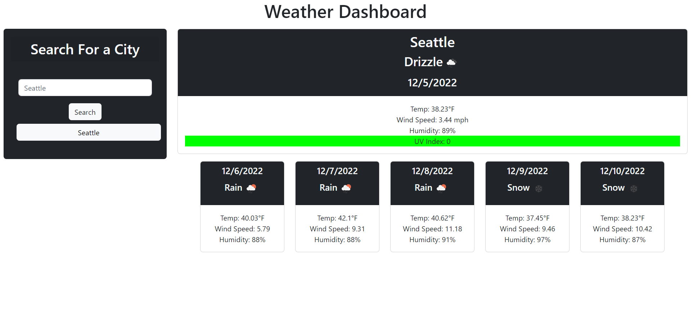

# Challenge 6 Weather Dashboard - 

## DESCRIPTION

A weatherdashboard utilizing the Openweathermap API

click here for deployed application:  
[https://sewprano.github.io/06ch-apis-weather-dashboard/](https://sewprano.github.io/06ch-apis-weather-dashboard/)

## TABLE OF CONTENTS

1. [Installation](#installation)
2. [Usage](#usage)
3. [Questions](#questions)

## INSTALLATION

NO instalation needed

## USAGE

Visit site, enter a city in seachbox, then click search

## QUESTIONS

For questions: 
Github profile: [sewprano](https://github/com/sewprano)